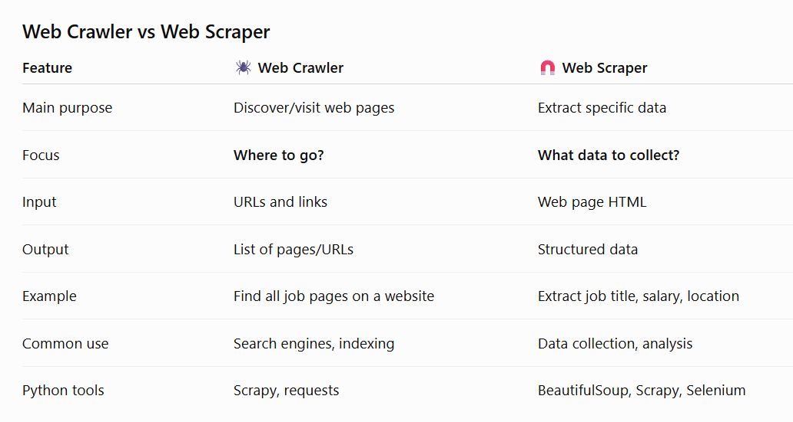
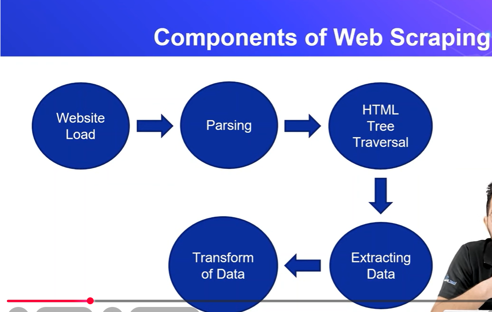

# Web Scraping

**What is Web scraping**
- Web scraping is an automatic method to obtain large amounts of data from websites.

- In most of the cases .. Web scraping is used on the **Unstructred Data.**

Web scraping extracts underlying HTML code and , with it, data stored in a database. The scraper can then replicate entire website content elsewhere.

                **Web Scraping** 
                      / \
                     /   \
                    /     \
            **Crawler**   **Scraper**

**web crawler**
 - it is collect all the link of websites and open them. (it collect data using their links)
 .
 - A **web crawler** is a program that automatically visits websites and collects information from their web pages.

 **web scraper**
 - It collect data from a webpage.

 

**Different types of web scrapers**

- Self-built Web scrapers
- pre-built web scrapers
- Browser extension web scrapers
- Software web scrapers
- Cloud web scrapers

**Python Language for webs scraping** 
1. Scrapy
2. BeautifulSoup
3. Selenium

 
**Components of Web scraping**

**Web Scraping is illegal**

- we can check what elements we can extract using **robots.txt** in the end of website Url.

